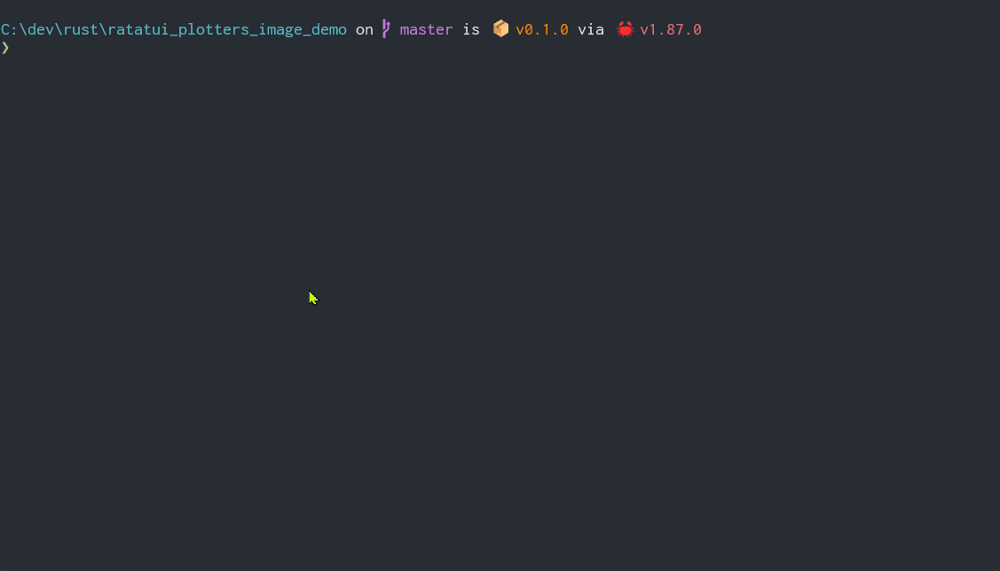

Demo of a [Ratatui](https://github.com/ratatui/ratatui) app displaying on-the-fly charts made with [plotters](https://github.com/plotters-rs/plotters), via [ratatui-image](https://github.com/benjajaja/ratatui-image) widget.

I'm using hardcoded, fictitious data, so I can focus on the performance of chart generation and encoding.

Part of my rust journey exploring async, channels, futures, tokio and ratatui.

Todo:
- [ ] improve image load time by either shrinking the image (with something like quantette), or using separate task for chart generation

### Disclaimer:
This project is for education purpose and does not represent financial advice in any way. Nor should it be used in trading applications.
